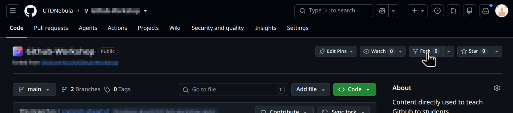
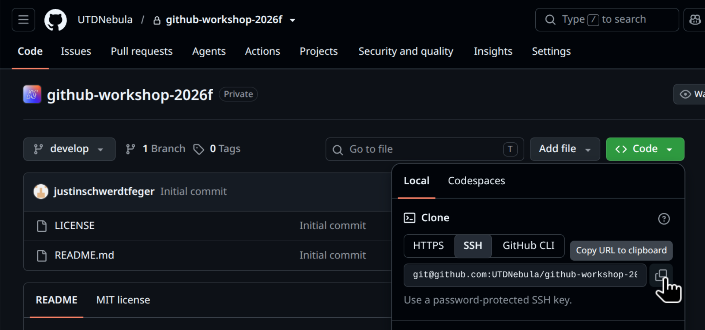

# Nebula Labs Git and GitHub Workshop

Welcome to the Nebula Labs Fall 2026 Git and Github workshop! If you run into any problems, don't be afraid to ask for help! Since this workshop is self guided, you can complete this at your own pace, or even share with others

Check out Nebula Lab's discord [here](https://discord.gg/t82yH6c5Mv). We're here to help!

You can find the optional slides associated with this workshop [here](https://docs.google.com/presentation/d/1bAFLI1-lTbMHA8uViJ5STYrv4VZj-Af6/edit?usp=sharing&ouid=110056758517350255566&rtpof=true&sd=true)

Be sure to check out the Git cheat sheet [here]

## Setup

### Important Background Information

When you see a line starting with `$` in a code block, such as `$ git status`, it means that is a command you can type in your terminal. Do not type the "$" itself.

---

The symbol `~` represents your home directory. For example, `~/Projects/` represents a folder called `Projects` inside your home directory. 
- On **Windows**, `~` is equivalent to `C:\Users\<YourUsername>` 
  - You can navigate to this folder in File Explorer by opening `This PC -> Local Disk (C:) -> Users -> <YourUsername>`
- On **macOS**, `~` is equivalent to `/Users/<YourUsername>`
  - You can navigate to this folder in Finder by clicking `Go -> Home` in the top menu bar.
- On **Linux**, `~` is usually equivalent to `/home/<YourUsername>`

---

If you're not using **Windows**, you can skip to [Install Required Tools](#install-required-tools). **Windows** has several different terminal environments, called **shells**. The most common shells are `PowerShell`, `Command Prompt`, `Git Bash`, and `WSL` (Windows Subsystem for Linux). `PowerShell` and `Command Prompt` are built-in to Windows. You can tell which shell you are using by looking at the prompt. It will look different depending on the shell.

For example, `PowerShell` will look something like this:
```cmd
PS C:\Users\<YourUsername>>
```

And `Command Prompt` will look something like this:
```cmd
C:\Users\<YourUsername>
```

`Git Bash` will look something like this:
```bash
<YourUsername>@<YourComputerName> MINGW64 ~/
```

And finally `WSL` will look something like this (Quite similar to Git Bash):
```bash
<YourUsername>@<YourComputerName> ~/
```

For this guide, we recommend using `PowerShell`, and all code blocks will assume you are using `Powershell`. You can change what shell your using by clicking the dropdown at the top of `Terminal`.

[] 


### Install Required Tools

#### Git CLI
Git is the version control system that tracks your changes. It is a command-line tool. 
- **Windows**: Download and install [Git for Windows](https://git-scm.com/download/win) (which includes Git Bash).
- **macOS**: Run `$ xcode-select --install`
- **Linux**: Git is likely already installed, but if not
  - Debian / Ubuntu: `$ sudo apt update && sudo apt install git`
  - Fedora: `$ sudo dnf install git`
  - Arch: `$ sudo pacman -S git`

Verify your installation:
```bash
$ git --version
```

#### GitHub Desktop
GitHub Desktop provides a visual interface for managing repositories, branches, and commits.
- Download and install from [desktop.github.com](https://desktop.github.com/).
- Launch GitHub Desktop and sign in to your GitHub account 

#### (Optional) Visual Studio Code (VS Code)
VS Code is a very popular and lightweight code editor with built-in Git tools and an integrated terminal.
- Download and install from [code.visualstudio.com](https://code.visualstudio.com/).
- Launch VS Code and go through the initial setup

#### (Optional) C Compiler
`calculator.c` is written in C. Installing a C compiler lets you compile and run the program locally.
- **Windows**: Install [MSYS2 / MinGW](https://www.msys2.org/), use WSL, or install [Visual Studio Build Tools](https://visualstudio.microsoft.com/downloads/).
  - If you're not sure which to pick, choose MinGW.
- **macOS**: You should already have it, but if you haven't already, run `$ xcode-select --install` in Terminal (installs `clang` / `gcc`).
- **Linux**:
  - Debian / Ubuntu: `$ sudo apt install build-essential`
  - Fedora: `$ sudo dnf groupinstall "Development Tools"`

Verify compiler installation:
```bash
$ gcc --version
```
or
```bash
$ clang --version
```

---

### Configure Git

(Add how to setup ssh with git here)

Set your name and email so your commits are properly attributed to your GitHub account:

```bash
$ git config --global user.name "Your Name"
$ git config --global user.email "your_email@example.com"
```

> [!IMPORTANT]
> Ensure the email address matches the one associated with your GitHub account so GitHub links commits to your profile.

### Fork this repository

Fork this repository by selecting the fork button on GitHub.



### Clone your forked repository

#### Choose a directory to store the project

> [!IMPORTANT]
> Git and other development tools will generate lots of files. This can cause slowdowns and other issues with **OneDrive**, **iCloud**, or **Google Drive**. Windows backs up the Desktop and Documents in OneDrive folders by default, and you may have these folders backed up with iCloud on macOS. For those reasons, consider putting your Git projects in `~/Projects/`. (Don't forget what `~` means from [Important Background Information](#important-background-information).)

After choosing a location and creating the folder, open that location in your terminal with `cd`. `cd` stands for "change directory". For example:
```bash
$ cd ~/Projects
```
Your terminal should now show that it is in `Projects/` or whatever directory you chose. It may not look exactly like this depending on your operating system, but it should now say "Projects" somewhere in your prompt.

```bash
user@hostname:~/Projects$
```

Copy the ssh url of your forked repository by selecting `<> Code` then `ssh`. It should start with `git@github.com`. Make sure you are **on the page of your fork** and not UTDNebula's github-workshop



#### Clone the Repository

Finally it's time to use our first real Git command!
```bash
$ git clone <ssh-url starting with git@github.com>
```

This will download the files from this Github repository (including this README.md file!) into a folder called `github-workshop-2026f`.

Enter that folder with
```bash
$ cd github-workshop-2026f
```

Use the `ls` command to see the contents of the directory
```bash
$ ls
```
In the command's output, you should see a file called `calculator.c`

Almost there! Now run `git status`
```bash
$ git status
```

This should say something like:
```bash
Your branch is up to date 
```
This means that your local repository is up to date with the remote repository on GitHub. If it's not that means we need to "pull" from the remote repository (GitHub). If we have changes, we can "push" them to GitHub

### 🎉 Congratulations you're ready! 🎉


## Working with Git

Now that we've cloned the repository, we can start working with Git through a series of challenges! Don't forget you can use the [Git Cheat Sheet] for reference with the git command line. Try using git through the command line, GitHub Desktop, and VS Code. This section has a lot less help, so if you get stuck, don't be afraid to ask for help!

### Open the Repository in GitHub Desktop and your code editor

Open **GitHub Desktop**. You should've installed this in [install required tools](#install-required-tools)

Add the repository with **File > Add Local Repository** and choose the `github-workshop-2026f` folder we cloned earlier

Open the `github-workshop-2026f` folder in your code editor. (In **VS Code**, **File > Open Folder**)

### Challenge 1: Staging and Committing

Edit `calculator.c`. Replace the text "Your Name Here" in the `print_banner(void)` function with your name.

Save your changes

Stage your changes

Commit your changes (don't forget to add an informative commit message)

You'll know you're done with this when you get this as the output to `$ git status`:

```bash
Your branch is ahead of '...' by 1 commit.
```

### Challenge 2: Feature Branching & Pushing

Create and switch to a new branch called `feature/multiply` 

Add this `multiply(int a, int b)` function to `calculator.c`:
```c
int multiply(int a, int b) {
    return a * b;
}
```

Stage and commit the change on your new branch.

Push your branch to your remote repository on GitHub.

Now, in GitHub, verify that your branch changes show when you try changing branches

### Challenge 3: Pull Request on GitHub

Open UTD-Nebula's github-workshop-2026f repository on GitHub

Open the `Pull requests` tab and create a Pull Request with your changes. You may need to click "Compare across forks" 

Write a clear PR title and a description explaining what you changed

### Challenge 4 Simulating & Resolving a Merge Conflict

This can be one of the most challenging parts of Git

A merge conflict happens when two branches modify the **same line of code** differently and Git cannot guess which version you want

```
                     ● [conflict-test-a]: banner says "Nebula Labs Git Workshop"
                    /
develop:  ● ───────● 
                    \
                     ● [conflict-test-b]: banner says "Nebula Labs GitHub Workshop"
```

#### Create the Conflicting Branches

##### Create branch `conflict-test-a`
1. Ensure you are on `develop` (or `main`).
2. Create and switch to a branch named `conflict-test-a`.
3. In `calculator.c`, change the title line in `print_banner()` to:
   ```c
   printf("Nebula Labs Git Workshop\n");
   ```
4. Stage and commit with message: `"Add Git to workshop banner"`.

##### Create branch `conflict-test-b` from the same starting point
1. Switch back to `develop` (or `main`).
2. Create and switch to another branch named `conflict-test-b`.
3. In `calculator.c`, change the **exact same title line** in `print_banner()` to:
   ```c
   printf("Nebula Labs GitHub Workshop\n");
   ```
4. Stage and commit with message: `"Add GitHub to workshop banner"`.

#### Trigger the Merge Conflict
Attempt to merge `conflict-test-b` into `conflict-test-a`


#### Inspect & Understand Conflict Markers
If merging with the command line, Git will create these conflict markers. VS Code tries to format them

```c
<<<<<<< HEAD
    printf("Nebula Labs Git Workshop\n");
=======
    printf("Nebula Labs GitHub Workshop\n");
>>>>>>> conflict-test-b
```

- `<<<<<<< HEAD`: The code currently on your active branch (`conflict-test-a`).
- `=======`: The separator between the two conflicting versions.
- `>>>>>>> conflict-test-b`: The incoming code from the branch being merged.

---

###  Resolve the Conflict & Finalize the Merge

Decide on the final code. Combine both ideas into a clean banner:
   ```c
   void print_banner(void) {
       printf("Nebula Labs Git/GitHub Workshop\n");
       ...
   }
   ```

Delete all conflict markers (`<<<<<<<`, `=======`, `>>>>>>>`).

Finish your merge. We often use a merge commit, but Git also supports rebasing 


## 💻 (Optional) Compiling and Running C Code

If you have a C compiler installed (`gcc` or `clang`):

Compile `calculator.c`
```bash
$ gcc calculator.c
```

This should create a new file named `a.exe` (on Windows) or `a.out` (on macOS/Linux).

Run the executable

On **Windows** using PowerShell
```bash
$ ./a.exe
```

On **macOS and Linux:**
```bash
$ ./a.out
```


### Expected Output
```text
Inputs: a = 12, b = 4
----------------------------------------
Addition:       12 + 4 = 16
Subtraction:    12 - 4 = 8
Multiplication: 12 * 4 = 48
```

## You're all set!

Congratulations! You have practiced the fundamental workflows used by software engineering teams worldwide:
